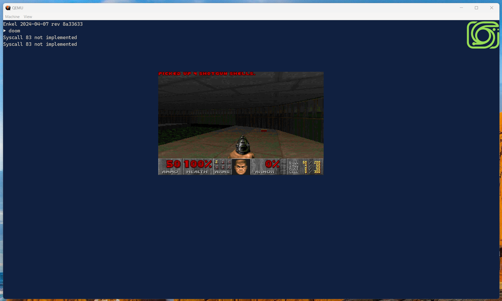

# Introduction

## What is it?

This is a hobby OS project to learn about operating system development, expand my exposure to low level concepts, and give myself an excuse to write some non-trivial assembly. Also because I thought it might be fun.

The goal is to build an UEFI-only 64-bit kernel and environment. I'll keep going until I get bored. It has not been boring so far.

## What does it look like?

## Why is it called Enkel?

I was looking for non-English synonyms for "simple" and "small" and `enkel` means simple/easy/uncomplicated in Swedish and Norwegian. It also means grandson in German, which somewhat fits with my theme for an OS reborn without the legacy ball and chain of having to support *real hardware* that people actually own and use. Imagine that!

## Can I use this as my main operating system?

No.

## Will it work on device X?

No, I'm employing the principle of `It works on my machine`, except right now it doesn't even do *that*!.

## What is the license?

MIT

## I want to make my own project, where should I start?

* OSDev.org
* Various other projects like this online (but don't copy them, where's the fun in that?)
* ChatGPT (GPT-4 specifically) is great for explaining topics but should not be trusted for specific low-level details, especially if it involves any kind of numerical value. It may be great at simple projects but its code at the OS level is pretty terrible. Still, it can be useful as a starting point.
* [OSDev Discord](https://wiki.osdev.org/Chat) - some great and very smart people over here from beginner to expert.
* It can explain things like qemu interrupt dumps though, which is **exceedingly** useful.

# What works

The headlines:
* Basic user mode support with thin Linux ABI compatability - this means you can run a subset of Linux user mode applications like...
* DOOM!

The technical bits:

* Scripts to build the ISO and makefiles to build everything
* A VSCode environment that allows for debugging via qemu under Windows (using WSL)
* GDB debugging scripts for things like exception handling, reading PML4 data for a given address
* A UEFI boot loader - you can just copy the files to USB and away you go
* A very rudimentary console/text/TTY output (including to serial port so you can copy and paste your logs on the terminal)
* Font rendering using BMFont format in a basic graphics mode
* Set the GDT and initialize the PML4 (virtual memory table) from the UEFI memory map
* Interrupt handling and stack traces
* Enter long mode 
* Remap the PIC, enable the PIT, use that to calibrate HPET, then turn PIT and PIC back off again (note HPET is not enabled by default in VirtualBox).
* Physical and Virtual memory allocation and protection flags
* Walk the APIC, find the Local APIC (LAPIC), and initialize the APs
* For each AP, step through 16-bit real mode, 32-bit protected mode then finally 64-bit long mode again and back into C
* Keyboard input and a very basic shell (`bash` support is ongoing)
* Syscalls (Including a subset of Linux syscalls allowing for binary compatability)
* User mode
* Dynamic library loading (including glibc and dynamic linking)
* Basic framebuffer support
* PCI, AHCI and reading from ATAPI CD
* FAT12, 16 & 32 (via library)

# Next steps

* Major refactor, especially around SATA & CD-ROM support
* Joliet/ISO 9660 CD format
* HDD support
* Scheduling

(Not necessarily in this order)
